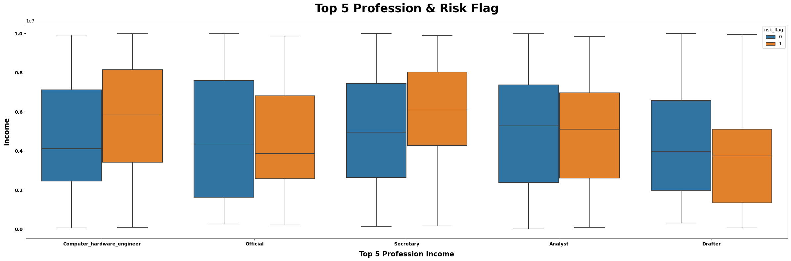

# Predicting Insurance Claims Severity


An end-to-end machine learning project aimed at predicting the severity of insurance claims based on various features provided by the Allstate dataset. The goal is to minimize prediction errors to improve business decisions.

## Motivation

With the rise of data-driven decisions in the insurance sector, understanding the potential severity of insurance claims is crucial for optimizing resources and enhancing customer experiences. This project seeks to leverage the power of machine learning, specifically using XGBoost and Neural Networks, to make accurate predictions and assist in informed decision-making.

## Build Status

The project is currently in a stable state. However, further improvements and optimizations are ongoing.

## Code Style

The code adheres to the standard Python PEP 8 style guide.

## Screenshots



## Tech/Framework used

- Programming Language: Python
- Libraries & Frameworks: pandas, sklearn, xgboost, keras, matplotlib, seaborn

## Features

- Comprehensive preprocessing including one-hot encoding and feature scaling.
- Model training using XGBoost for regression.
- Neural Network model with Keras for regression, complete with callbacks like Early Stopping.
- Comprehensive data visualization for understanding feature importance and distribution.
- Evaluation metrics and residual analysis.

## Code Examples

```python
import xgboost as xgb
dtrain = xgb.DMatrix(train_preprocessed, label=y_train)
bst = xgb.train(params, dtrain, num_boost_round=1000)
